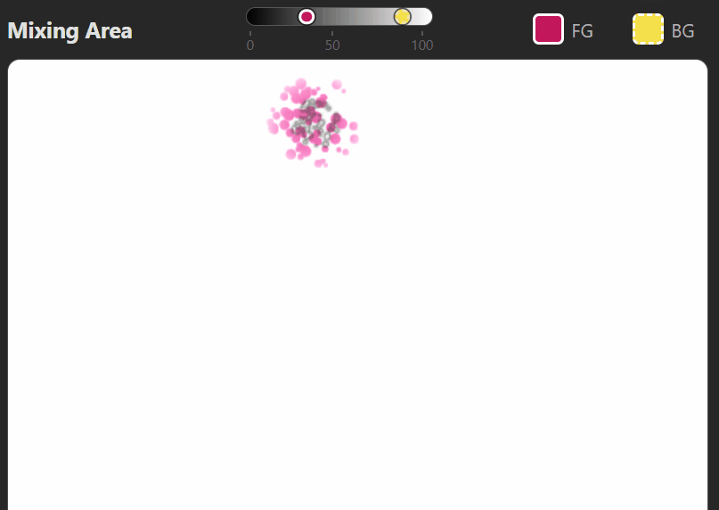
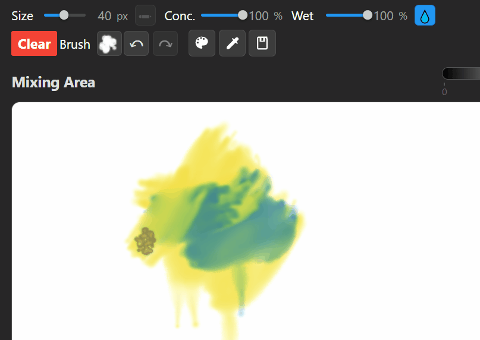
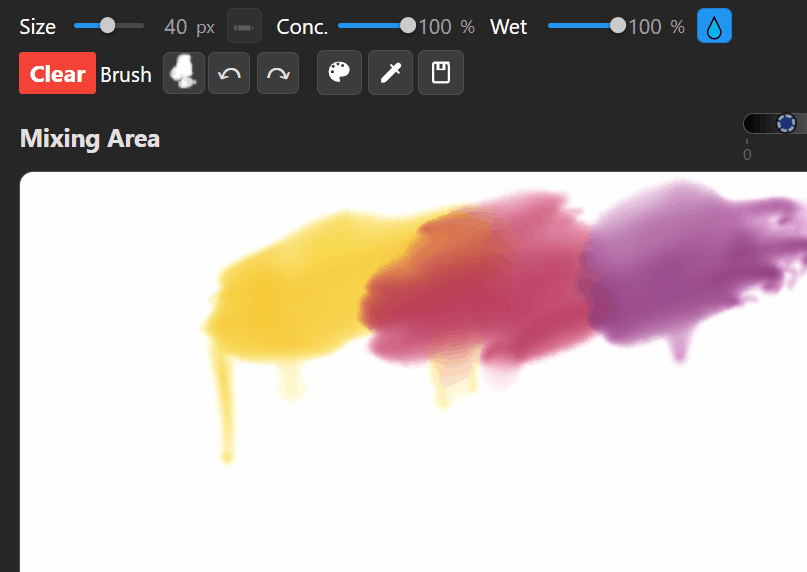
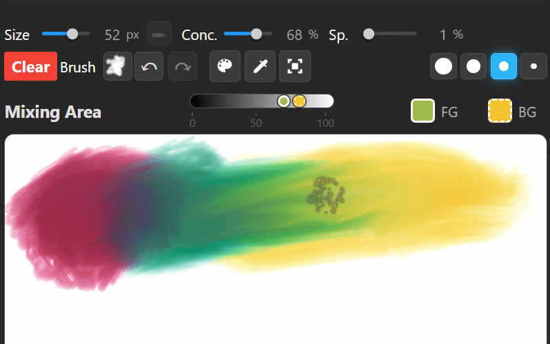
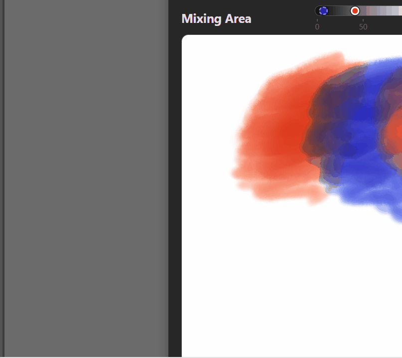

# 🎨 Mixbox Palette for Adobe Photoshop

[点击查看中文版](#-mixbox-调色板---adobe-photoshop-插件) · [日本語版はこちら](README.ja.md)

A UXP plugin for realistic pigment mixing in Adobe Photoshop, with dual physical mixing engines.

*Real subtractive pigment mixing — yellow + blue = green, not muddy gray.*

---

## Watercolor brushes

Layered watercolor strokes blend naturally — wet edges, soft transitions, adjustable concentration (1–100).

## Smudge & blend on canvas

Smudge tool blends colors directly on the canvas, just like mixing paint on a palette.

## Value ruler

Picks a color, the ruler shows its perceived brightness. Great for keeping values under control.

## Resizable canvas

Drag the handles on either side of the black panel to resize the mixing canvas (480–2000px).

---

## Dual Mixing Engines — MB / KM

Switch anytime via the **MB/KM** button in the top-left. Canvas auto-repaints from stroke history.

- **Mixbox (MB)** — Default. [Mixbox](https://scrtwpns.com/mixbox/) LUT-based algorithm, CC BY-NC 4.0. Hand-tuned anchor pigments → expressive, lively mixing (deep red + white can drift to vivid pink/magenta). Covers faster per stroke.
- **KM** — Self-implemented. 32³ LUT maps RGB to 38-wavelength reflectance spectra (data from [spectral.js](https://github.com/rvanwijnen/spectral.js), MIT), then Kubelka-Munk mixing in spectral space. GPL v3. No anchor approximation → hue stays stable when diluted (deep red stays red, browns stay brown). Blends more gradually with wider transition bands.

Neither is "more correct" — pick MB for expressive mixing within its sweet spot, pick KM for predictable hue preservation and watercolor-style washes. Differences show up most in the 25–75% concentration range and on composite colors.

Try the [KM Tuner](https://food211.github.io/Mixbox-Palette/km-tuner.html) to compare side by side.

---

## More Features

- **4 professional palettes** — Winsor & Newton Cotman, Schmincke Horadam, Kuretake Gansai, Digital Artist
- **6 brush presets** — Circle, Soft, Watercolor, Splatter, Flat, Dry; brush and smudge each remember their last preset
- **Right-click paint** — drag to paint with background color
- **Eyedropper** — `Alt + Left/Right Click` for foreground/background
- **Transfer to Photoshop** — export a region of the mixing canvas directly to your active layer
- **Bidirectional color sync** — plugin ↔ Photoshop, including PS color picker, swatches, X swap, D reset
- **Zoom** — 60%–150% via top-right dropdown
- **Undo/Redo** — up to 50 steps, GPU-backed canvas snapshots
- **Auto-save** — canvas, settings, and history persist automatically
- **Multilingual** — English / 中文 / 日本語, auto-detects system language

---

## Installation

### From Adobe Marketplace
1. Visit [MixBox Watercolor Palette on Adobe Marketplace](https://exchange.adobe.com/apps/cc/cc9344fb/mixbox-watercolor-palette)
2. Install and open from Photoshop `Plugins` menu

### From Release (.ccx)
1. Download the latest `.ccx` file from [Releases](https://github.com/food211/Mixbox-Palette/releases)
2. Double-click the `.ccx` file to install
3. Open from Photoshop `Plugins` menu

### Developer Mode
1. Clone this repository
2. Open Adobe UXP Developer Tool
3. Load the `uxp-host/` directory (NOT the root directory)
4. Open from Photoshop `Plugins` menu

## Usage

1. **Select a palette** — click the "Palette" button to switch paint brands
2. **Pick a color** — click a swatch to set as foreground color
3. **Paint** — draw on the mixing canvas to blend colors
4. **Use in Photoshop** — selected colors sync to PS automatically; PS color changes sync back

### Transfer Pixels to Photoshop
1. Select an area on your Photoshop canvas
2. In the plugin, switch to the rect select tool
3. Draw a region on the mixing canvas — selected pixels transfer to the active layer

### Keyboard Shortcuts

| Key | Action |
|-----|--------|
| `B` | Brush tool |
| `S` | Smudge tool |
| `I` | Eyedropper tool |
| `X` | Swap foreground/background colors |
| `Shift` (hold) | Temporary smudge tool |
| `Alt` (hold) | Temporary eyedropper |
| `Alt + Left Click` | Pick foreground color |
| `Alt + Right Click` | Pick background color |
| `Right Click` (drag) | Paint with background color |
| `Esc` | Exit rectangle select |

## Architecture

WebView hybrid: UI and mixing engines hosted remotely (Cloudflare Pages, GitHub Pages fallback). The local UXP host is a minimal bridge that loads the remote UI and syncs colors to Photoshop. Updates roll out automatically without reinstalling. Service Worker caches everything for offline use after first load.

## Tech Stack

- **Mixing Engines**: Mixbox (LUT-based, CC BY-NC 4.0) + KM (38-wavelength Kubelka-Munk, spectral data from spectral.js MIT, GPL v3)
- **Rendering**: WebGL (mixing) + Canvas 2D (cursor, overlays)
- **Platform**: Adobe UXP + WebView
- **Hosting**: Cloudflare Pages (primary) / GitHub Pages (fallback)
- **Offline**: Service Worker, Cache-First strategy
- **Storage**: localStorage for canvas, history, and settings

## License

Two licenses in this project:

- **Original code** (KM engine, UI, etc.) — [GPL-3.0](LICENSE)
- **Mixbox library** (`js/mixbox.js`) — [CC BY-NC 4.0](https://creativecommons.org/licenses/by-nc/4.0/) (non-commercial only, by Secret Weapons)

When using the Mixbox engine, the CC BY-NC 4.0 restriction applies. The KM engine has no such restriction.

## Trademarks

Adobe and Photoshop are either registered trademarks or trademarks of Adobe in the United States and/or other countries.

## Changelog

See [Changelog](https://food211.github.io/Mixbox-Palette/changelog.html) for version history.

## Support

- ⭐ Star this project
- 💬 [Join our Discord](https://discord.gg/d3ubWGpe) — bug reports, feedback, and discussion
- 🐛 [Report bugs](https://github.com/food211/Mixbox-Palette/issues)
- 💡 Suggest features
- ☕ Support my open-source work: Alipay food211@qq.com / WeChat 172660507

---

# 🎨 Mixbox 调色板 - Adobe Photoshop 插件

[Click here for English version](#-mixbox-palette-for-adobe-photoshop) · [日本語版はこちら](README.ja.md)

Adobe Photoshop UXP 调色板插件，内置双物理混色引擎，模拟真实颜料混合效果。

*真实减色混合 —— 黄+蓝=绿，不是糊成灰。*

---

## 水彩笔刷

水彩叠笔自然过渡，湿边、柔和衔接，浓度可调（1–100）。

## 画布上的涂抹混色

涂抹工具直接在画布上混色，就像在调色盘里调颜料。

## 明度标尺

吸取颜色，标尺自动显示该颜色的感知亮度，控制画面明度关系很顺手。

## 可调画布大小

拖拽黑色面板两侧的 handle 调整混色画布宽度（480–2000px）。

---

## 双混色引擎 —— MB / KM

左上角 **MB/KM** 按钮随时切换，画布自动用笔画历史重绘。

- **Mixbox (MB)** — 默认。基于 [Mixbox](https://scrtwpns.com/mixbox/) LUT 算法，CC BY-NC 4.0。人工调校的锚点颜料 → 表现力强、色彩"出彩"（深红+白能推到鲜亮的粉红/品红）。同浓度下覆盖更快。
- **KM** — 自研。32³ LUT 把 RGB 映射到 38 波长反射率光谱（光谱数据来自 [spectral.js](https://github.com/rvanwijnen/spectral.js)，MIT），在光谱空间应用 Kubelka-Munk 公式混色。GPL v3。无锚点近似 → 色相稀释时稳定（深红稀释仍是红、棕色薄涂仍是棕）。混色更渐进，过渡带更宽更柔和。

没有谁更"对" —— 想要"出彩、有表现力"选 MB；想要"色相稳、还原忠实、水彩薄涂"选 KM。差异在 25–75% 浓度区间和复合色上最明显。

可使用 [KM Tuner](https://food211.github.io/Mixbox-Palette/km-tuner.html) 对比两引擎效果。

---

## 更多特性

- **4 套专业调色盘** —— 温莎牛顿 Cotman、施美尔 Horadam、吴竹 Gansai、数字艺术家
- **6 种笔刷预设** —— 圆形、柔和、水彩、飞溅、平头、干笔；画笔和涂抹工具各自记忆上次使用的笔刷
- **右键绘制** —— 右键拖拽使用背景色绘制
- **吸管工具** —— `Alt + 左键/右键` 取色为前景/背景
- **传输至 PS** —— 将混色画布的区域传输到 Photoshop 活动图层
- **双向颜色同步** —— 插件 ↔ Photoshop，包含拾色器、色板、X 交换、D 复位
- **缩放控制** —— 右上角下拉菜单，60%–150%
- **50 步撤销/重做** —— 直接保存画布快照，使用 GPU 显存记录增量
- **自动保存** —— 画布、历史和设置自动保存
- **多语言支持** —— English / 中文 / 日本語，自动跟随系统语言，可手动切换

---

## 安装

### 通过 Adobe Marketplace
1. 访问 [MixBox Watercolor Palette - Adobe Marketplace](https://exchange.adobe.com/apps/cc/cc9344fb/mixbox-watercolor-palette)
2. 安装后从 Photoshop `插件` 菜单打开

### 从 Release 下载 (.ccx)
1. 从 [Releases](https://github.com/food211/Mixbox-Palette/releases) 下载最新 `.ccx`
2. 双击 `.ccx` 文件安装
3. 从 Photoshop `插件` 菜单打开

### 开发者模式
1. 克隆本仓库
2. 打开 Adobe UXP Developer Tool
3. 加载 `uxp-host/` 目录（注意不是根目录）
4. 从 Photoshop `插件` 菜单打开

## 使用说明

1. **选择调色盘** —— 点击"Palette"按钮切换颜料品牌
2. **选取颜色** —— 点击色块设置为前景色
3. **混色** —— 在混色画布上绘制
4. **同步到 PS** —— 选取的颜色自动同步到 Photoshop；反之 PS 改色也会同步回插件

### 传输像素到 Photoshop
1. 在 Photoshop 画布上用任意选区工具选好区域
2. 在插件中切换到矩形选取工具
3. 在混色画布上框选 —— 所选像素自动传输到活跃图层的选区范围

## 快捷键

| 按键 | 功能 |
|------|------|
| `B` | 画笔工具 |
| `S` | 涂抹工具 |
| `I` | 吸管工具 |
| `X` | 交换前景/背景色 |
| `Shift`（按住）| 临时切换为涂抹工具 |
| `Alt`（按住）| 临时切换为吸管工具 |
| `Alt + 左键` | 取色为前景色 |
| `Alt + 右键` | 取色为背景色 |
| `右键`（拖拽）| 使用背景色绘制 |
| `Esc` | 退出矩形选取 |

## 架构说明

WebView 混合架构：UI 和混色引擎托管在远端（Cloudflare Pages，GitHub Pages 备用）。本地 UXP Host 是个最小桥接，负责加载远端 UI 和同步颜色到 Photoshop。更新自动下发不需要重装。首次加载后 Service Worker 缓存全部内容供离线使用。

## 许可证

本项目包含两种许可证的代码：

- **自研代码**（KM 引擎、UI 等）— [GPL-3.0](LICENSE)
- **Mixbox 库**（`js/mixbox.js`）— [CC BY-NC 4.0](https://creativecommons.org/licenses/by-nc/4.0/)（仅限非商业用途，由 Secret Weapons 提供）

使用 Mixbox 引擎时，整体使用受 CC BY-NC 4.0 限制；KM 引擎无此限制。

## 商标声明

Adobe 和 Photoshop 是 Adobe 在美国和/或其他国家/地区的注册商标或商标。

## 更新日志

查看 [更新日志](https://food211.github.io/Mixbox-Palette/changelog.html) 了解版本历史。

## 赞助

- ⭐ Star 本项目
- 💬 [加入 Discord 社区](https://discord.gg/d3ubWGpe) — 反馈问题、提出建议、日常交流
- 🐛 [提交 Bug](https://github.com/food211/Mixbox-Palette/issues)
- 💡 提出功能建议
- ☕ 支持开源：支付宝 food211@qq.com / 微信 172660507
